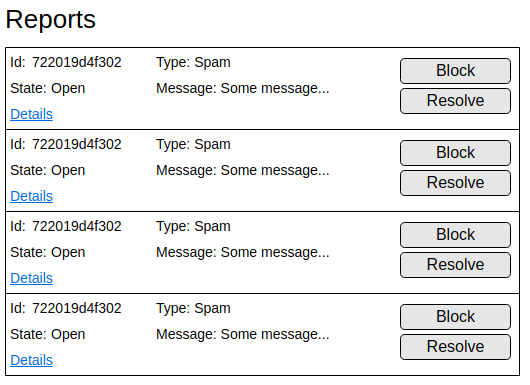

# report-react-app
Full stack application for our spam protection team that consists of a server and a web based UI in order to manage reported content.

## Challenge description

This challenge imagines that we have a social media platform that is under attack from spam. We have implemented a reporting system for users that lets them report spam to the platform, and our spam protection team.  

The challenge is to create a small full stack application for our spam protection team that consists of a server and a web based UI in order to manage reported content.

The UI should look something like:

Furthermore we need a way to _block_ the content and _resolve_ those reports. The two buttons in the UI should do a call to your backend service in order to block the content or to resolve the ticket. You are free to implement the blocking as you want, however the resolving should be defined as a `PUT` request to an endpoint with this structure `/reports/:reportId`. An example request for how to update a report is in [`data/update_ticket_request.json`](data/update_ticket_request.json).

- **`Block`:** Means that the content should no longer be available to users
- **`Resolve`:** Means that the report is considered "resolved", and it is no longer visible to the spam protection team
- **`Details`:** Functionality can be ignored.
